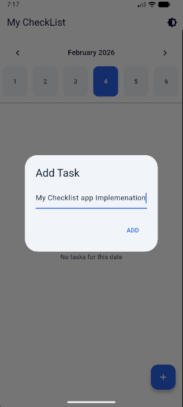
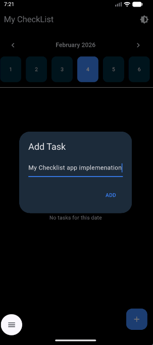
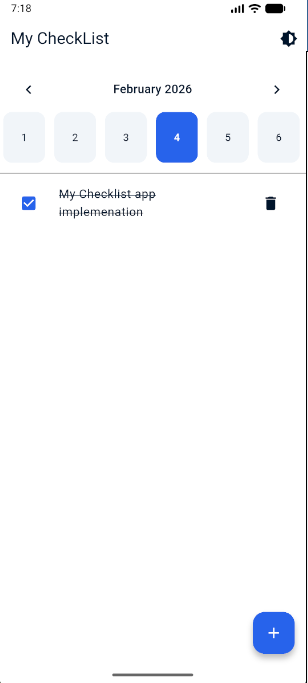
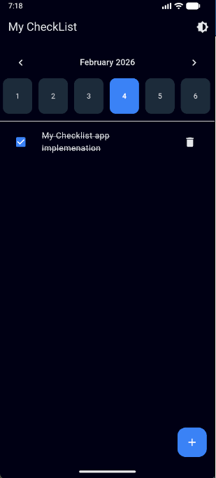
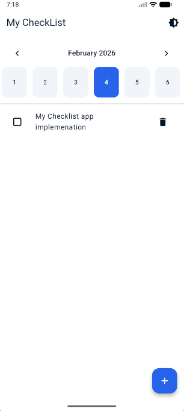
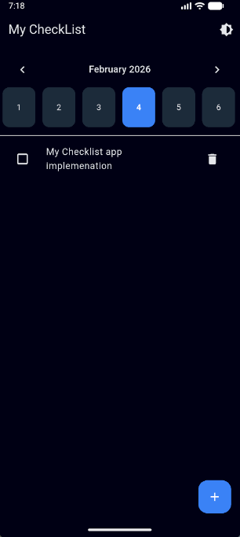

# 📅 Task App (Flutter)

A clean, scalable **Flutter task management app** built using **feature-first architecture**, **BLoC**, and **local persistence**.  
Tasks are organized by **month and day**, with support for **dark/light theme**, **offline storage**, and a modern calendar-based UX.

---

## ✨ Features

- 📆 **Calendar-based task management**
  - Navigate between months
  - Select any day to view tasks
  - Current day is visually highlighted

- ✅ **Task operations**
  - Add tasks per day
  - Mark tasks as complete
  - Delete tasks

- 🌙 **Theme support**
  - Light & Dark mode
  - Theme selection persists across app restarts

- 💾 **Local persistence**
  - Tasks stored locally
  - Data remains after app restart

- 🧱 **Scalable architecture**
  - Feature-first folder structure
  - Clear separation of concerns
  - Ready for future expansion (sync, auth, etc.)

---

## 📱 App Screenshots
<p align="center">
  
  
</p>

<p align="center">
  
  

</p>


<p align="center">
  
  
</p>


## 🏗 Architecture Overview

The project follows **Clean Architecture + Feature First**:

```

lib/
├── core/
│   ├── theme/
│   ├── utils/
│   └── storage/
│
├── features/
│   └── tasks/
│       ├── data/
│       ├── domain/
│       └── presentation/
│
├── injection.dart
├── app.dart
└── main.dart

````

### Layers

- **Presentation**
  - UI and BLoC state management
- **Domain**
  - Business logic and use cases
- **Data**
  - Local storage implementation

---

## 🛠 Tech Stack

- **Flutter**
- **flutter_bloc** – state management
- **Hive** – local storage
- **GetIt** – dependency injection
- **Intl** – date formatting

---

## 🚀 Getting Started

### Prerequisites

- Flutter SDK (3.x or later)
- Dart SDK

### Run the app

```bash
flutter pub get
flutter run
````

---

## 🎨 App Icon

The app uses a custom launcher icon generated via `flutter_launcher_icons`.

To regenerate icons:

```bash
dart run flutter_launcher_icons
```

---

## 📌 Future Improvements

* Task reminders / notifications
* Cloud sync
* Search and filtering
* Automated tests
* Analytics

---

## 📄 License

This project is for learning and demonstration purposes.

---


